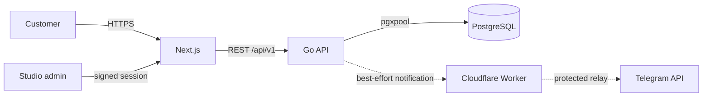

# Romanov Records

[](https://github.com/woka00/romanov-records/actions/workflows/ci.yml)
[](backend/go.mod)
[](frontend/package.json)
[](docker-compose.yaml)

Production booking platform for a Moscow recording studio: a public website,
conflict-safe scheduling API, protected administration workflow and operational
infrastructure in one repository.

**[Live website](https://romanov-records.ru)** · **[Architecture](docs/architecture.md)** · **[Deployment runbook](docs/deployment.md)**


## Product and ownership

The platform replaces booking requests spread across messengers with one
workflow. A customer selects a service and an available time, PostgreSQL
atomically protects the schedule from overlaps, staff receive a Telegram
notification, and the request is processed in a private admin panel.

I designed, built and currently operate the complete technical platform:
backend architecture, data model, frontend integration, security controls,
container infrastructure, production deployments and incident resolution.

| Area | Implementation |
| --- | --- |
| Public experience | Responsive Next.js website and booking flow |
| Backend | Versioned REST API written in Go |
| Persistence | PostgreSQL, managed SQL migrations and connection pooling |
| Scheduling | Database-enforced exclusion constraint; conflicting requests return `409 Conflict` |
| Administration | Protected request queue with explicit booking lifecycle |
| Authentication | bcrypt password hashes and HMAC-signed, expiring, HTTP-only sessions |
| Notifications | Failure-isolated Telegram delivery through an optional protected Cloudflare relay |
| Operations | Multi-stage images, health checks, graceful shutdown, structured logs and CI |

## Architecture



The backend is a modular monolith. Each feature is split into transport,
service and repository layers; domain types and HTTP infrastructure remain
independent of UI concerns. This keeps deployment simple for the current scale
without giving up testable boundaries.

The most important business invariant is enforced by PostgreSQL rather than by
the browser. A GiST exclusion constraint rejects overlapping time ranges even
when two requests arrive concurrently. Cancelling a booking releases its slot.
See [the architecture notes](docs/architecture.md) for the reasoning and
trade-offs.

## API overview

| Method | Endpoint | Access | Purpose |
| --- | --- | --- | --- |
| `GET` | `/healthz` | Public | Process liveness |
| `GET` | `/readyz` | Public | Database readiness |
| `GET` | `/api/v1/bookings/busy?date=YYYY-MM-DD` | Public | Occupied 30-minute slots |
| `POST` | `/api/v1/bookings` | Public, rate-limited | Create a booking request |
| `POST` | `/api/v1/admin/login` | Public, rate-limited | Start an admin session |
| `GET` | `/api/v1/admin/bookings` | Admin | List booking requests |
| `PATCH` | `/api/v1/admin/bookings/{id}/status` | Admin | Update booking lifecycle |
| `POST` | `/api/v1/admin/logout` | Admin | End the session |

Machine-readable statuses are `new`, `confirmed`, `completed` and `cancelled`;
localisation is handled by the frontend.

## Local development

### Requirements

- Docker Engine with Docker Compose v2
- GNU Make
- Go 1.25 and Node.js 22 for running quality checks outside containers

### Start the complete stack

```bash
cp .env.example .env
make up-build
```

Open:

- website: <http://localhost:3000>
- API: <http://localhost:8080/api/v1>
- health: <http://localhost:8080/readyz>

Create an administrator after the services become healthy:

```bash
make admin-create
```

The command prompts for the credentials, hashes the password with bcrypt and
performs a parameterised upsert; plaintext credentials are never stored in
PostgreSQL or written to shell history.

## Quality checks

```bash
make check
```

The same checks run in GitHub Actions:

- backend unit tests with the race detector;
- `go vet`;
- PostgreSQL integration test for overlapping bookings and cancellation;
- production-dependency security audit, ESLint and an optimised Next.js build;
- validation of the final Docker Compose configuration.

Dependabot monitors Go modules, npm packages, GitHub Actions and base images.

## Configuration

All configuration is environment-based; `.env` is ignored and only safe
placeholders are committed in [.env.example](.env.example). Important groups:

- `DATABASE_*` — credentials and bounded connection-pool settings;
- `HTTP_*` — listener, CORS and server timeouts;
- `ADMIN_SESSION_SECRET` — at least 32 random characters;
- `TELEGRAM_*` — optional bot, recipients and protected relay;
- `NEXT_PUBLIC_SITE_URL` / `BACKEND_URL` — public and internal routing.

Generate production secrets with a cryptographically secure tool, for example
`openssl rand -hex 32`. Never reuse the example values.

## Repository layout

```text
backend/
  cmd/                         application and admin CLI entrypoints
  internal/core/               domain, database, auth and HTTP infrastructure
  internal/features/           bookings, administrators and notifications
  migrations/                  reversible PostgreSQL migrations
frontend/
  app/                         Next.js routes and server actions
  components/                  public booking and marketing UI
ops/cloudflare/                optional Telegram relay
docs/                          architecture and operations documentation
.github/workflows/             continuous integration
```

## Operations and security

The API container is published only on `127.0.0.1`; TLS termination and public
routing belong to the host reverse proxy. Request bodies are bounded, unknown
JSON fields are rejected, public write endpoints are rate-limited, HTTP server
timeouts are explicit, and request IDs are included in structured logs.

Operational procedures, migration checks, backup/restore commands and the
Telegram relay setup are documented in [docs/deployment.md](docs/deployment.md).
No production database, credentials or customer booking data are included in
this repository.

## Deliberate trade-offs

- A modular monolith is easier to operate than distributed services at the
  studio's current scale.
- Telegram delivery is best-effort and never delays booking creation. A durable
  outbox would be the next step if delivery guarantees become a requirement.
- The admin panel is intentionally internal; no public demo credentials are
  published because the production system contains personal data.

## Licence

This is commercial project source published as a portfolio case study. No
licence is granted for reuse of the code, brand assets or studio content.
