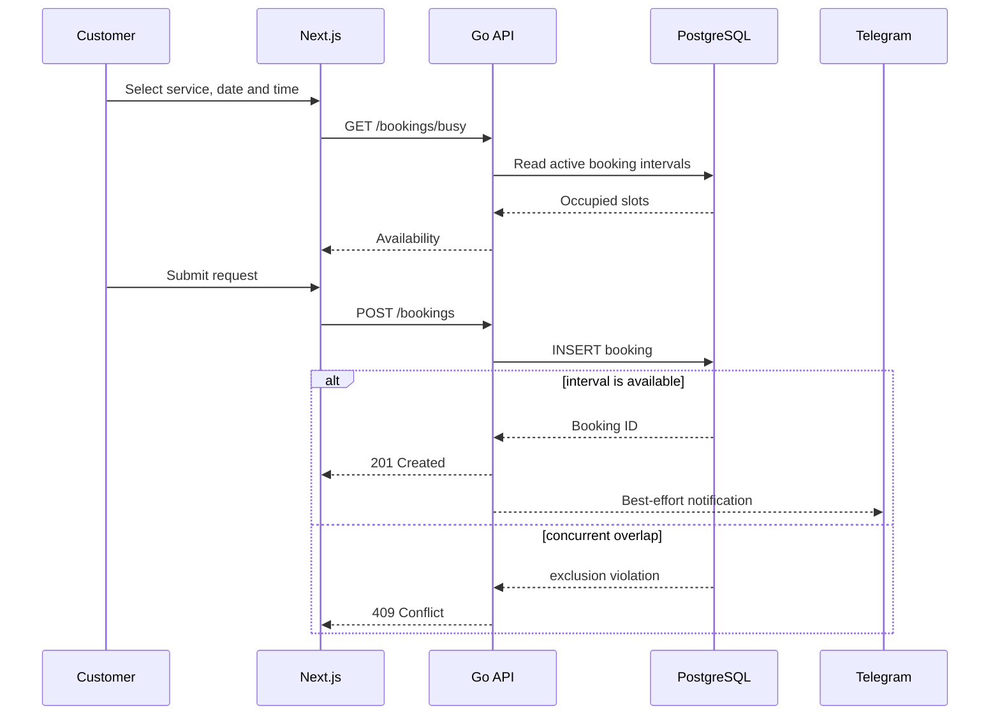

# Architecture

## Context

Romanov Records needs a small operational system rather than a generic content
site. Customers must see current availability, submit a request without taking
an already occupied slot, and receive a fast response from studio staff. The
studio needs a private queue that remains inexpensive and straightforward to
operate.

## Runtime view

## Backend boundaries

The Go service is organised by feature:

- **transport** owns HTTP routing, request decoding and response DTOs;
- **service** validates inputs and coordinates use cases;
- **repository** owns SQL and maps database failures to domain-level errors;
- **domain** contains stable business types such as `BookingStatus`;
- **core** contains cross-cutting database, authentication and HTTP concerns.

Interfaces point inward. The booking service depends on a small repository and
notifier contract, allowing unit tests to exercise business logic without a
database or external API.

## Scheduling consistency

Availability shown in a browser is advisory because it becomes stale as soon as
another request arrives. The authoritative rule therefore lives in PostgreSQL.

Migration `000003_booking_integrity` creates an exclusion constraint over the
half-open interval `[start, end)`. PostgreSQL atomically rejects intersecting
active bookings with SQLSTATE `23P01`; the repository maps that condition to
`ErrBookingConflict`, and the HTTP layer returns `409 Conflict`.

Cancelled bookings are excluded from the constraint, so their time is released.
Remote services use the documented sentinel date `1970-01-01` and do not reserve
studio time.

## Authentication and trust boundaries

- Administrator passwords are hashed with bcrypt.
- Sessions contain only administrator ID and expiry, signed with HMAC-SHA256.
- Signatures use constant-time comparison.
- Cookies are HTTP-only, `SameSite=Lax`, and secure on HTTPS.
- Admin routes verify the session in the Go API even if the Next.js UI has
  already checked for cookie presence.
- The backend port binds to loopback in production Compose configuration.
- Login and booking creation have independent per-IP rate limits.

The application trusts `X-Forwarded-For` because the backend is reachable only
through the local reverse-proxy path. It must not be exposed directly without
changing that trust configuration.

## Reliability model

- `pgxpool` bounds and reuses PostgreSQL connections.
- Migrations finish before the API starts.
- Readiness includes a database ping; liveness only verifies the process.
- HTTP header, read, write and idle timeouts prevent unbounded connections.
- SIGINT/SIGTERM trigger graceful HTTP shutdown.
- Panics are recovered at the HTTP boundary and correlated through request IDs.
- Telegram has its own client timeout and cannot make booking creation fail.

Telegram delivery is intentionally best-effort. If guaranteed delivery becomes
commercially important, the next evolution is a transactional outbox table and
a retrying worker rather than an in-process goroutine.

## Why a modular monolith

The service has one database, one deployment owner and a modest request volume.
Splitting it into network services would add failure modes and operational cost
without improving the current product. Feature boundaries leave a clear path to
extract a component later if its scaling or ownership needs diverge.
